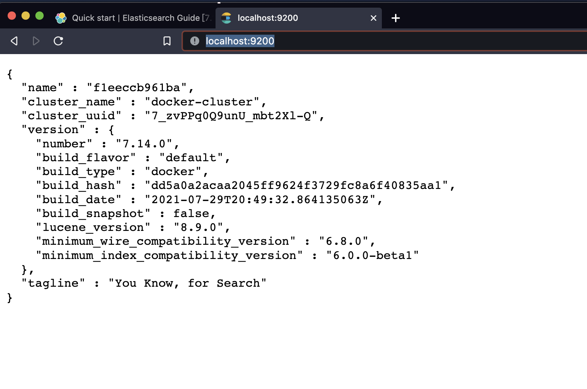

# Using Docker

[based on official documentation](https://www.elastic.co/guide/en/elasticsearch/reference/current/getting-started.html)

# Elastic Search

1. `docker network create elastic` - create a docker network env called `elastic`
2. `docker pull docker.elastic.co/elasticsearch/elasticsearch:7.14.0` pull docker image which is elasticsearch version `7.14.0`
3. `docker run --name es01-test --net elastic -p 9200:9200 -p 9300:9300 -e "discovery.type=single-node" docker.elastic.co/elasticsearch/elasticsearch:7.14.0` 
   - run a docker container from `docker.elastic.co/elasticsearch/elasticsearch:7.14.0`
   - port forwarding `9200`
   - name `es01-test`
   - environment variable `discovery-type=single-node`
   - network config `slastic`

4. Open your browser `http://localhost:9200/`

</img>

check by command line

```
(base) yulongtsai@YudeMacBook-Pro:~/Desktop$ curl -X GET http://localhost:9200/
{
  "name" : "f1eeccb961ba",
  "cluster_name" : "docker-cluster",
  "cluster_uuid" : "7_zvPPq0Q9unU_mbt2Xl-Q",
  "version" : {
    "number" : "7.14.0",
    "build_flavor" : "default",
    "build_type" : "docker",
    "build_hash" : "dd5a0a2acaa2045ff9624f3729fc8a6f40835aa1",
    "build_date" : "2021-07-29T20:49:32.864135063Z",
    "build_snapshot" : false,
    "lucene_version" : "8.9.0",
    "minimum_wire_compatibility_version" : "6.8.0",
    "minimum_index_compatibility_version" : "6.0.0-beta1"
  },
  "tagline" : "You Know, for Search"
}
```

# Kibana

1. `docker pull docker.elastic.co/kibana/kibana:7.14.0` - pull docker image `docker.elastic.co/kibana/kibana:7.14.0`
2. `docker run --name kib01-test --net elastic -p 5601:5601 -e "ELASTICSEARCH_HOSTS=http://es01-test:9200" docker.elastic.co/kibana/kibana:7.14.0`
   - run a container from `docker.elastic.co/kibana/kibana:7.14.0`
   - name `kib01-test`
   - network config `elastic`
   - port forwarding `5601`
   - environment variable - `ELASTICSEARCH_HOSTS=http://es01-test:9200`

check the containers :

```
(base) yulongtsai@YudeMacBook-Pro:~/Desktop$ docker ps -a
CONTAINER ID   IMAGE                                                  COMMAND                  CREATED              STATUS              PORTS                                                                                  NAMES
30379c22c2b4   docker.elastic.co/kibana/kibana:7.14.0                 "/bin/tini -- /usr/l…"   About a minute ago   Up About a minute   0.0.0.0:5601->5601/tcp, :::5601->5601/tcp                                              kib01-test
f1eeccb961ba   docker.elastic.co/elasticsearch/elasticsearch:7.14.0   "/bin/tini -- /usr/l…"   15 minutes ago       Up 15 minutes       0.0.0.0:9200->9200/tcp, :::9200->9200/tcp, 0.0.0.0:9300->9300/tcp, :::9300->9300/tcp   es01-test
```

3. check `http://localhost:5601/app/home` on your browser


