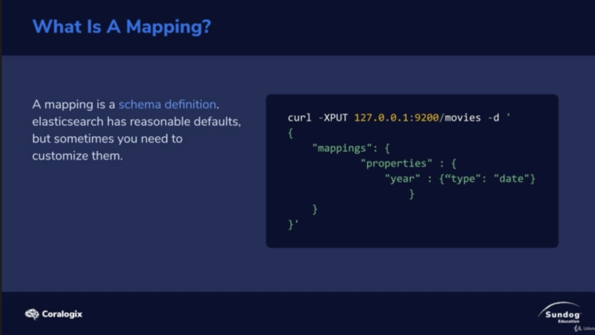
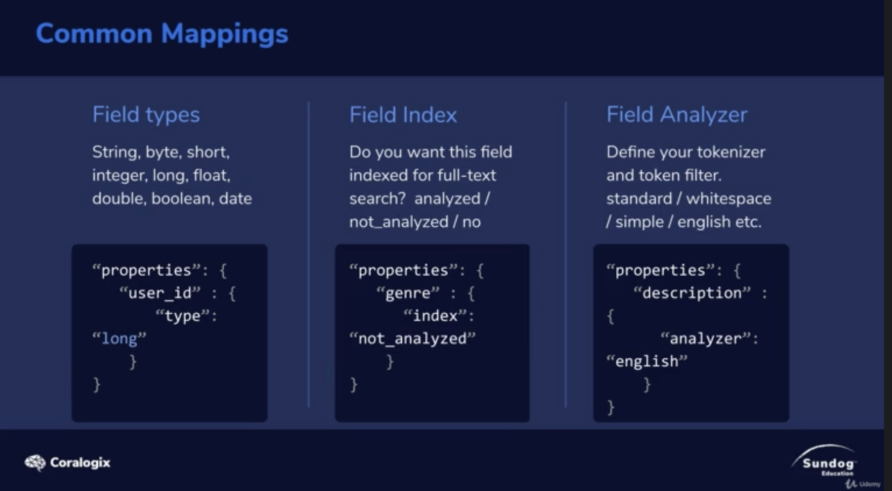
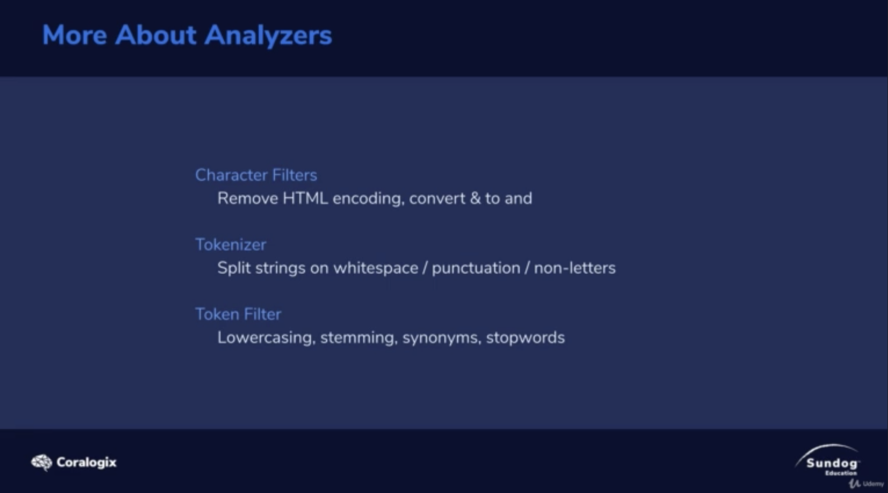
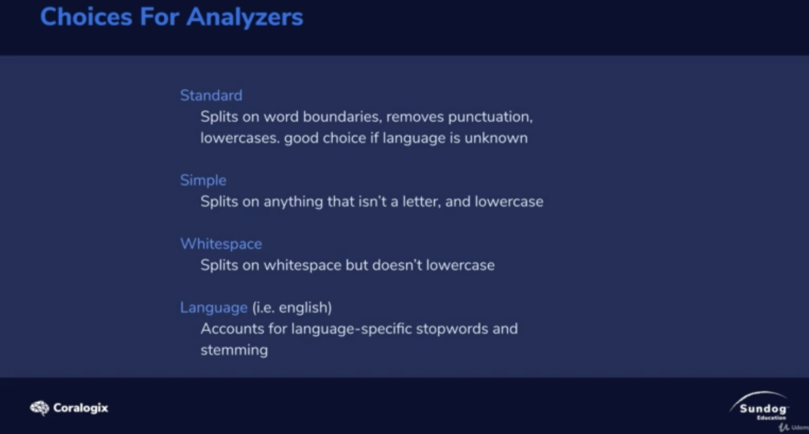

# Mapping

Mapping : `shcema definition`

# Common Mappings

Due to elastic-search is a NoSQL Database

so it support search in `text`

Field types : string, bytes, short, integer, long, float, double, boolean, date.

Field Index (If you want this field indexed for full-text search) : analyzed, not analyzed

Field Analyzer : (Define your tokenizer and token filter) : standard / whitespace / simple /english ... etc

# Analyzer

Choice for analyzers

1. standard : splits on word boundaries, remove punctuation, lowercase, good choice if language is unkown.
2. Simple : splits on anything that isn't a letter and lowercase
3. whitespace : Splits on whitespace but doesn't lowercase
4. Language : Accounts for language-specific stopwords and stemming.

