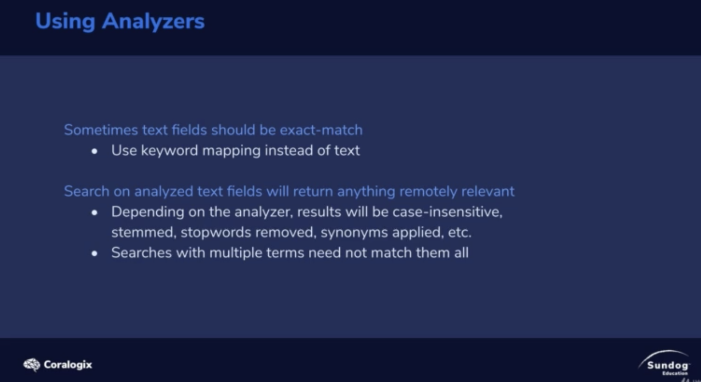

# Controlling Full-Text search

1. Sometimes twxt fields should be exact-match
   * use keyword mapping instead of text
2. Search on analyzed text fields will return anything remotely relevant.
   * depending on the analyzer, results will be case-insensitive, stemmed, stopwords, removed, synonyms, applied, etc.
   * searches with multiple terms need not match them all.

</img>
