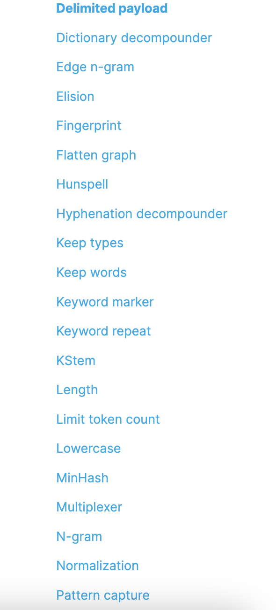

# Controlling Full-Text search

1. Sometimes text fields should be exact-match
   * use keyword mapping instead of text
2. Search on analyzed text fields will return anything remotely relevant.
   * depending on the analyzer, results will be case-insensitive, stemmed, stopwords, removed, synonyms, applied, etc.
   * searches with multiple terms need not match them all.

</img>

check `24_analyzer_and_tokenizer.es`.

# [Analyzer](https://www.elastic.co/guide/en/elasticsearch/reference/7.16/analysis-analyzers.html)

character filters --> tokenizer --> token filters


1. standard - divides text into terms on word boundaries, as defined by the unicode text segmentation algo.
   1. remove most punctuation
   2. lowercases terms
   3. removing stop words
2. simple - divided text into terms 
   1. whenever it encounters a character which is not a letter
   2. lowercases all terms
3. whitespace
   1. any whitespace character
4. stop 
   1. like `simple`
   2. but supports removal of stop words
5. keyword
   1. accepts whatever text it is given and output the exact same text as single term
6. pattern
   1. regular expression to split the text into terms
   2. supports lower-casing and stop words
7. language
   1. language-specific analyzers like `english` or `french`
8. fingerprint
   1. creates a fingerprint which can used for duplicates detection.

9. `custom` - build your own

# [Character Filter](https://www.elastic.co/guide/en/elasticsearch/reference/7.16/analysis-charfilters.html)

preprocess the steeam of characters before it's passed to `tokenizer`

1. html strip character filter - strips out HTML element libe `<b>`, and decodes HTML entities like `&amp;`
2. mapping character filter - filter replaces any occurrences of the specified strings with specified replacements.
3. pattern replace character filter - matching a regular expression with specified replacement.

# [Token filter](https://www.elastic.co/guide/en/elasticsearch/reference/7.16/analysis-asciifolding-tokenfilter.html)

accept a stream of tokens from a tokenizer and can modify tokens

1. apostrophe - strips all chars after an apostrophe(for turkish language)
2. ascii folding - converts alphabetic, numeric, symbolic chars into ASCII equivalent(if exist)

```
GET /_analyze
{
  "tokenizer" : "standard",
  "filter" : ["asciifolding"],
  "text" : "açaí à la carte"
}
```

```
[ acai, a, la, carte ]
```

3. CJK bigram filter - forms bigram out of CJK(Chinese, Japanese, and Korean)

```
GET /_analyze
{
  "tokenizer" : "standard",
  "filter" : ["cjk_bigram"],
  "text" : "東京都は、日本の首都であり"
}
```

```
[ 東京, 京都, 都は, 日本, 本の, の首, 首都, 都で, であ, あり ]
```

4. CJK width - normalized width difference in CJK(Chinese, Japanese, and Korean)

```
GET /_analyze
{
  "tokenizer" : "standard",
  "filter" : ["cjk_width"],
  "text" : "ｼｰｻｲﾄﾞﾗｲﾅｰ"
}
```

```
シーサイドライナー
```

5. Classic  - removes english possessive (`'s`) form the end of words and removes dots from acronyms

```
GET /_analyze
{
  "tokenizer" : "classic",
  "filter" : ["classic"],
  "text" : "The 2 Q.U.I.C.K. Brown-Foxes jumped over the lazy dog's bone."
}

```

```
[ The, 2, QUICK, Brown, Foxes, jumped, over, the, lazy, dog, bone ]
```

6. common gram - generates bigrams for a specified set of common words

```
GET /_analyze
{
  "tokenizer" : "whitespace",
  "filter" : [
    {
      "type": "common_grams",
      "common_words": ["is", "the"]
    }
  ],
  "text" : "the quick fox is brown"
}
```

```
[ the, the_quick, quick, fox, fox_is, is, is_brown, brown ]
```

7. conditional - applied a set of token filters to tokens that match conditions in a provided predicate script

```
GET /_analyze
{
  "tokenizer": "standard",
  "filter": [
    {
      "type": "condition",
      "filter": [ "lowercase" ],
      "script": {
        "source": "token.getTerm().length() < 5"
      }
    }
  ],
  "text": "THE QUICK BROWN FOX"
}
```

```
[ the, QUICK, BROWN, fox ]
```

8. Decimal digit - convert all digits in the unicode `Decimal_Number` to `0-9`

```
GET /_analyze
{
  "tokenizer" : "whitespace",
  "filter" : ["decimal_digit"],
  "text" : "१-one two-२ ३"
}
```

```
[ 1-one, two-2, 3]

```

9. Delimited payload - separates a token stream into tokens and payloads based on a specified delimiter

```
GET _analyze
{
  "tokenizer": "whitespace",
  "filter": ["delimited_payload"],
  "text": "the|0 brown|10 fox|5 is|0 quick|10"
}

```

```
[ the, brown, fox, is, quick ]

```

10. fingerprint token filter - sorts and remove duplicate token from a token stream, then concatenates the stream into a single token.
    1.  sort tokens list alphabetically
    2.  remove duplicate instance of the the token list
    3.  concatenates the token stream


```
GET _analyze
{
  "tokenizer" : "whitespace",
  "filter" : ["fingerprint"],
  "text" : "zebra jumps over resting resting dog"
}
```

```
[ dog jumps over resting zebra ]

```

</img>

</img>