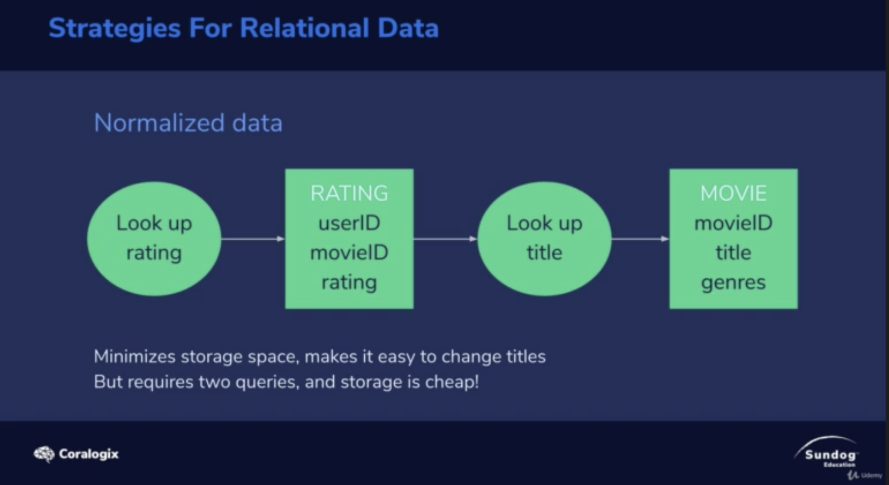
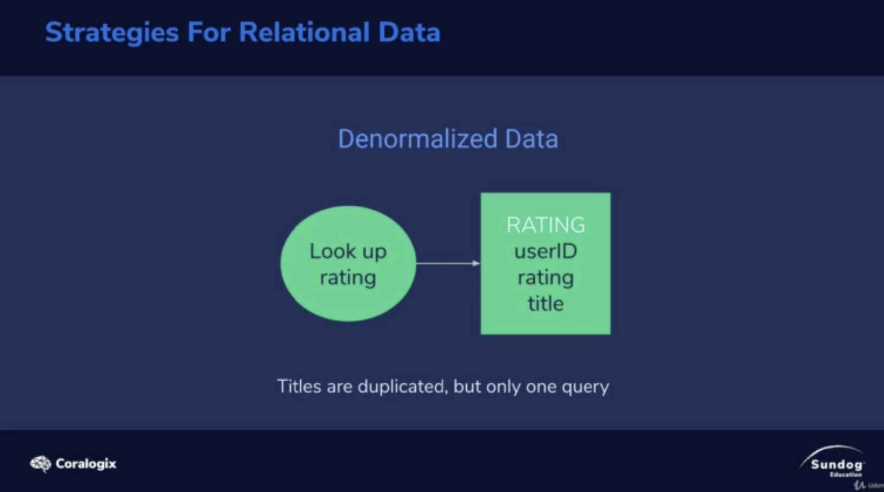
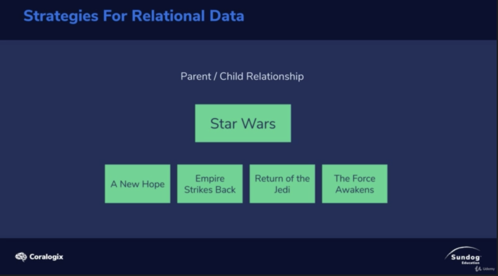

# Intro

a lot of distributed system like Cassandra or mongo D.B.

They ususally de-normalized your data.

Let's talk about normalizing and denormalizeing in ElasticSearch

Also how to represent parent child relationships.

# Mormalizing and Denormalizing
## Strategies for Relational Data

</img>

Using a movieID to minimize if we want to store 2 copy of movie title.

Then we do a normazlization, split 2 tables, using movieID to JOIN in tables.

**if you are in elastic-search**

Split your data into 2 index, hurt your `full-text-search`

and storage is very cheap these day.

## Denormalized Data

</img>

pros :

1. one query instead of two query (JOIN)
2. storage is cheap

cons : 

when we update the title name(if table is big)

# Parent and Child Relationship

</img>

TODO 02:55

