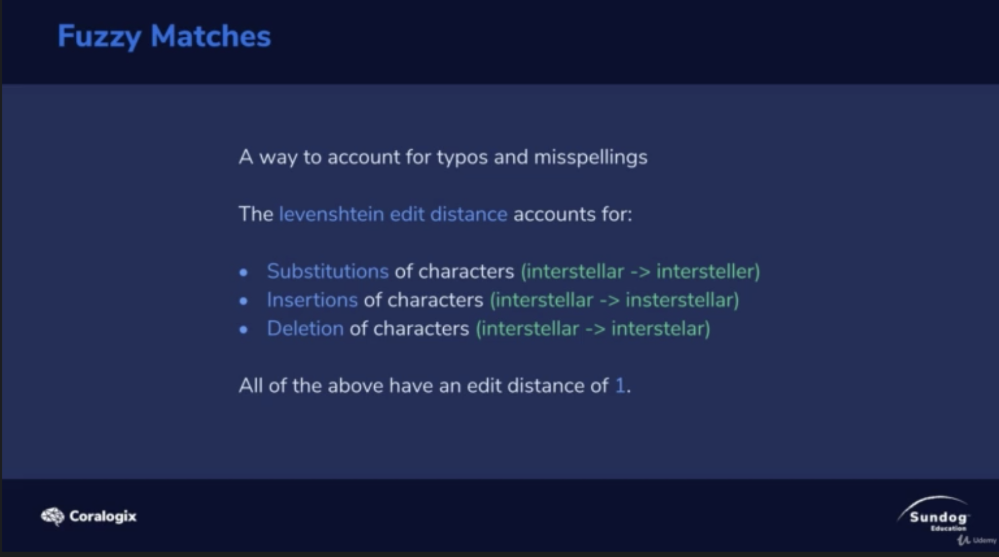
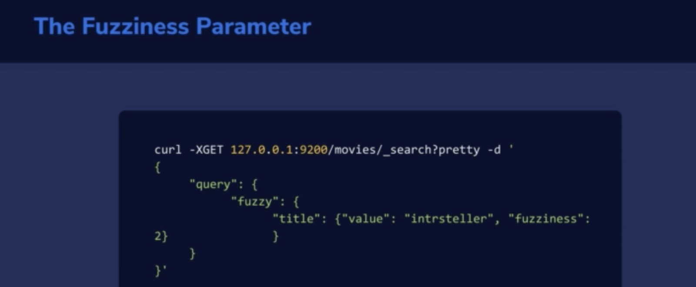
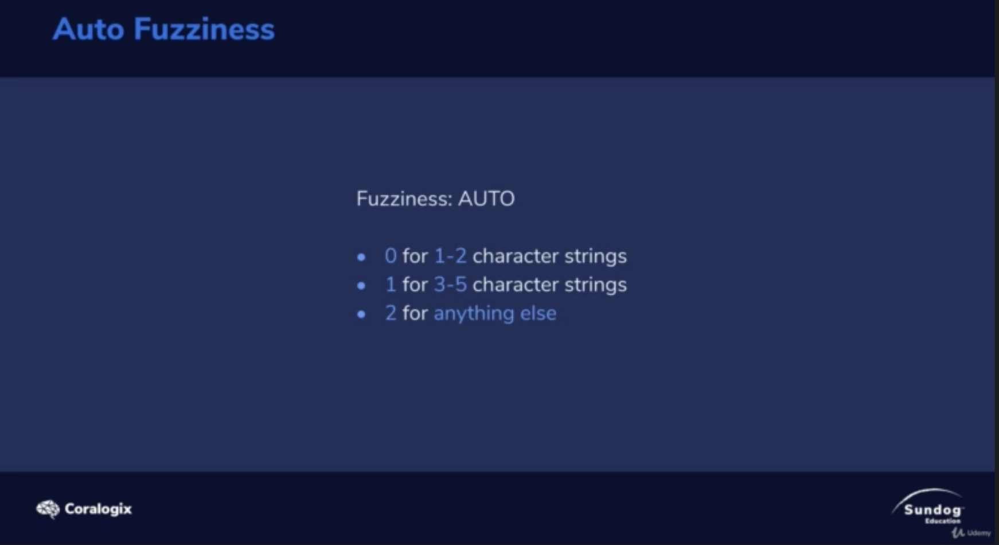

# Fuzzy Match

</img>

handling typos and misspellings 

Levenshtein edit distance

1. Substitutions : interstellar --> interstell`e`r
2. Insertions : interstellar --> in`s`terllar
3. Deletions --> interstellar --> interstel` `ar

</img>

</img>