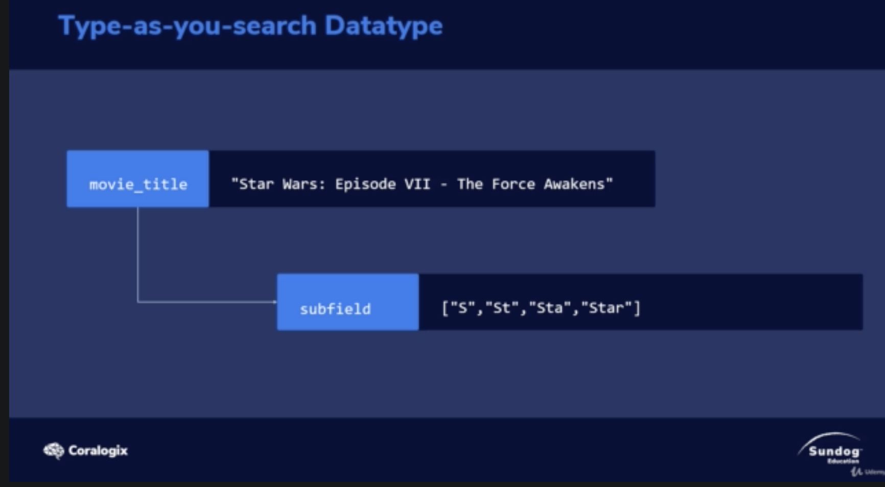
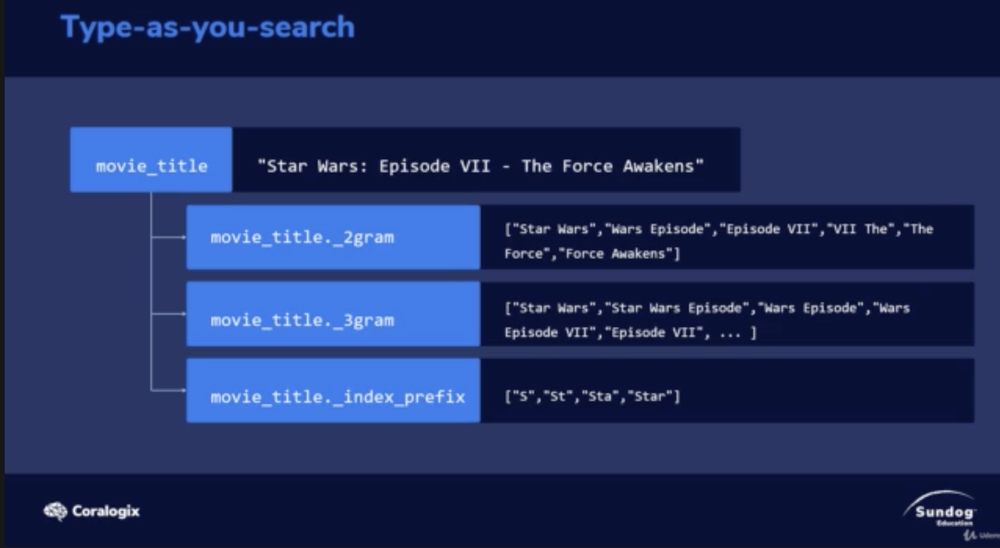

# Type-as-you-search Datatype

When you build a type-as-you-search Datatype
ES build several subfiled

1. ngram

</img>

1. 2gram and 3 gram in `movie-title` called shingle in ES.

2. edge ngram token filter(prefix)

</img>

https://www.elastic.co/guide/en/elasticsearch/reference/7.x/search-as-you-type.html