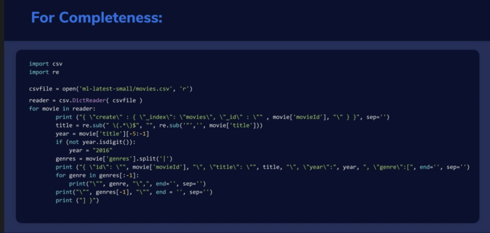

# Intro

you can import data into es with a lot of connector

we can import data into es in realtime!

# With Scripts

1. submit bulk document via REST API
2. Logstasg and beats can stream data from logs, s3, databases and more.
3. AWS systems can stream in data via lambda or kinesis firehose
4. Kafka, spark and more have Elasticsearch integration add ons.

</img>

check the `006_insert_file.es` for details.

Some interesting command

`curl -XDELETE 127.0.0.1:9200/movies`
