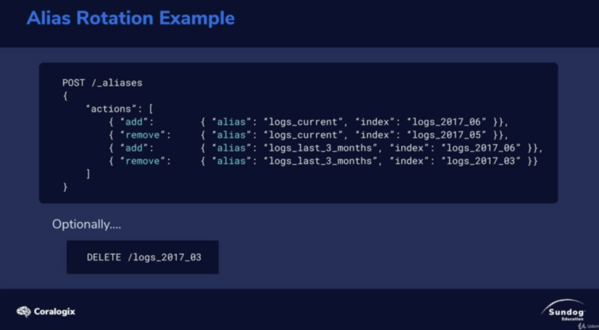

# Multiple Indices As A Scaling Strategy

1. Make a new index to hold new data
2. Seach both indices
3. Use index aliases to make this easy to do

* With time-based data, you can have one index per time frame(e.g. hourly, daily, monthly)
* Common strategy for log data where you usually just want current data, but don't want to delete old data either.
* You can use index aliases ie "logs_current", "last_3_months". to point to specific indices as they rotate.

# Code

When you add alias, you can search it from alias for both index!

and you can remove the alias of index which you don't want to be searched.

Then you won't delete any index.