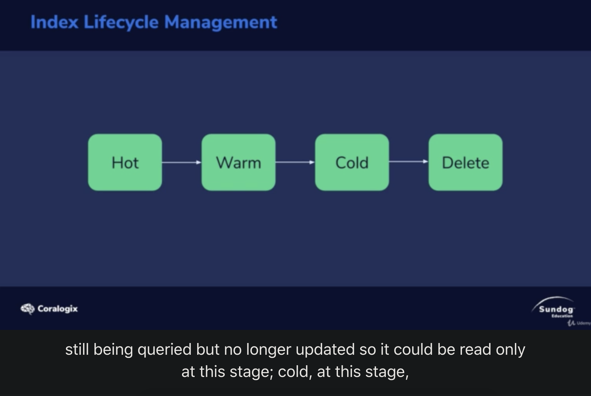
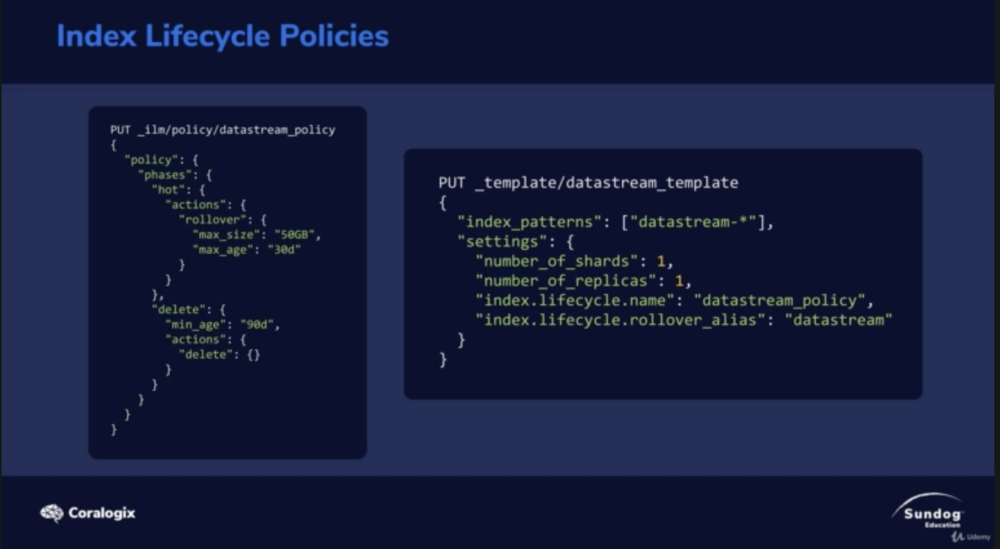

# Index Lifecycle

1. Hot - actively updating, queryed
2. Warm - read only, no longer updated
3. Cold - queried infeqently, no longer updated

Using such a policy, you can monitor your indecies via monitor!