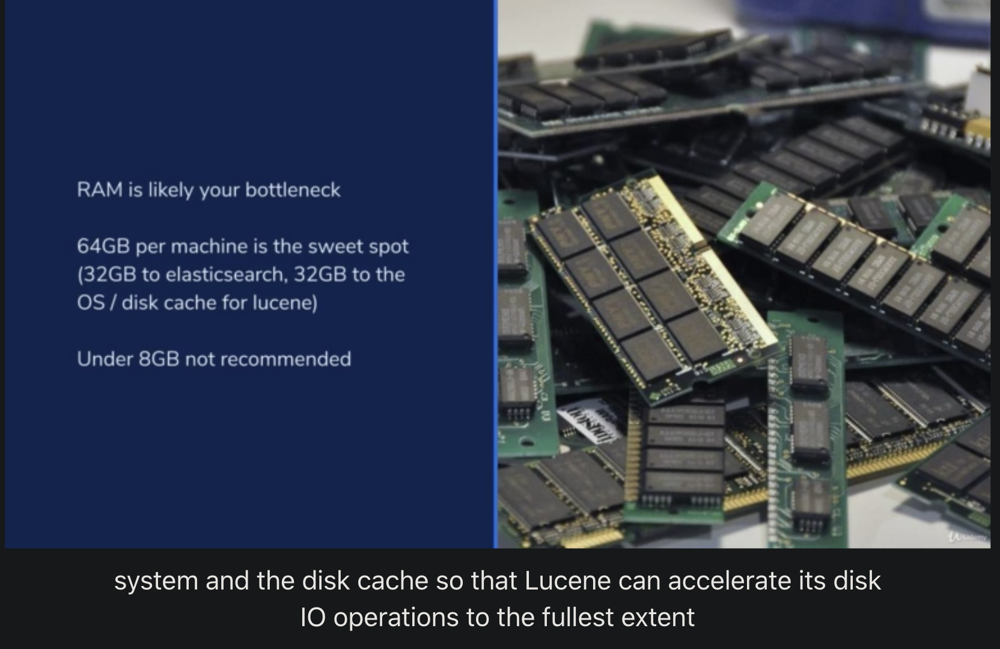

# RAM is likely your bottleneck

ES is heavliy IO Bound - use SSD and fast network.

Not heavily CPU bound.

So if your application is cloud native, Build ES on cloud.

Instead, your applcation is on the ground. Use SSD and local network!

memory stats : https://opster.com/elasticsearch-glossary/elasticsearch-memory-usage/
