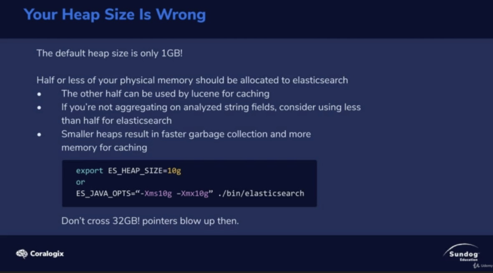

# Your Heap Size is Wrong

The default heap size is only 1GB, So if you're running on a machine that has 64GB of RAM. You're only uasing 1 GB of that!

1. Generally you wanna allocate half of your machine RAM for ES, the other for the operating system.

2. If you're not using `aggregation` and text `analyze` field. You can use less memory of ES.

3. However, more memory make garbage collection slower as well. 

