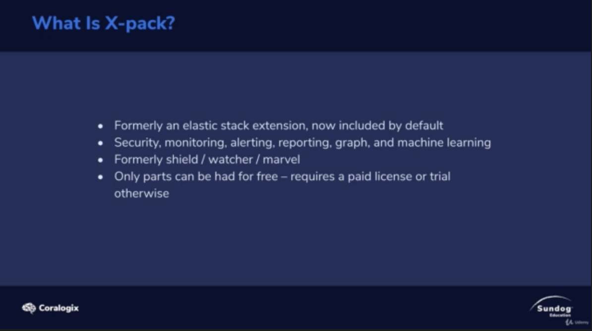
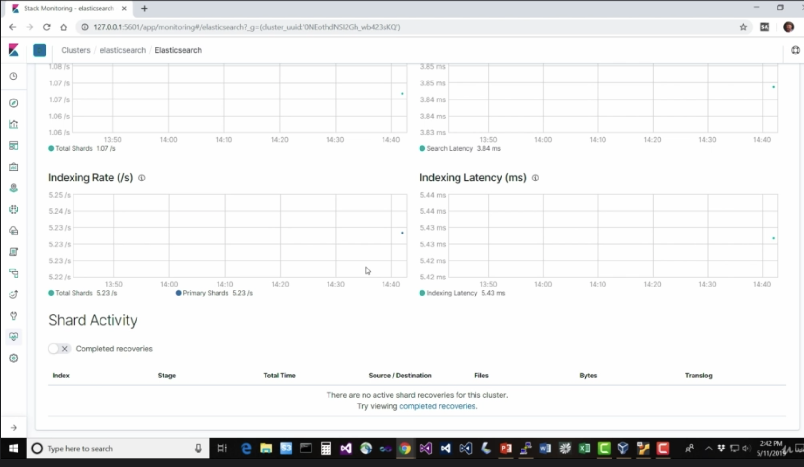
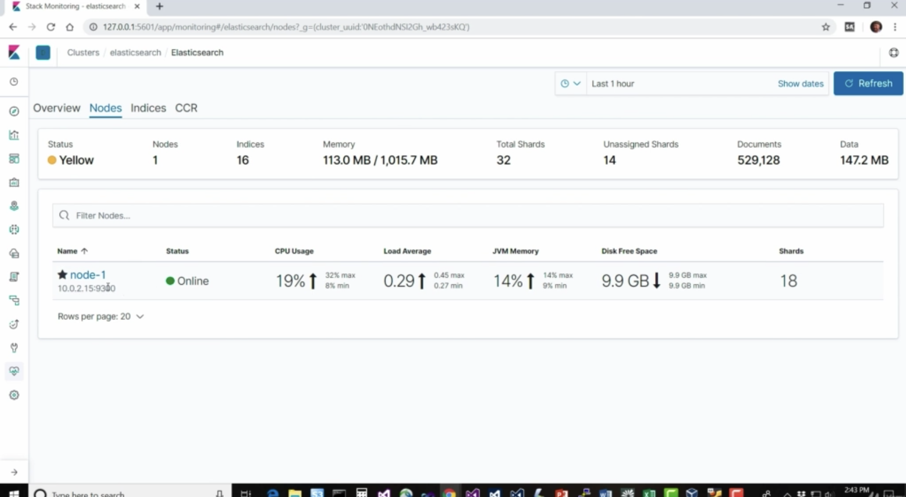
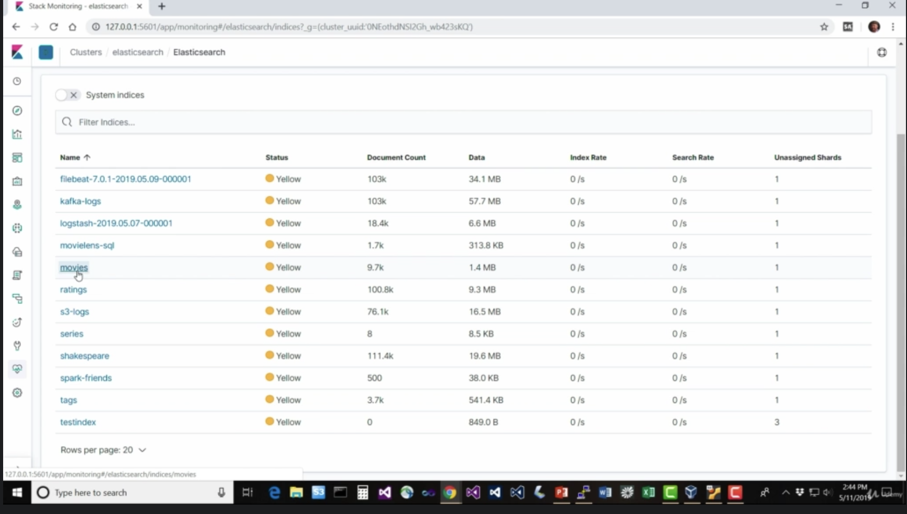

# Monitoring - Xpack

X-pack --> shield / watcher / marvel --> official in es

1. Generally you wanna allocate half of your machine RAM for ES, the other for the operating system.

2. If you're not using `aggregation` and text `analyze` field. You can use less memory of ES.

3. However, more memory make garbage collection slower as well. 

click Monitoring stack on your kibina server.

Another Simple dashboard, you can click kibina / discover

You need to set up xpack stuff locally or in `dockerfile`

