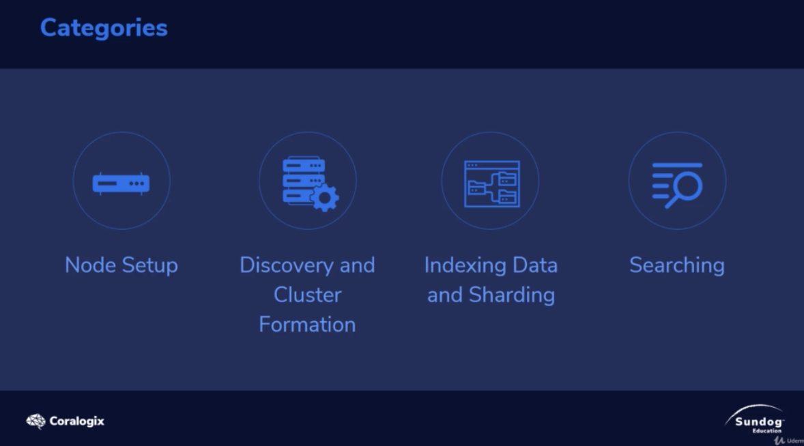

# Common Issues

# Categories

Issues could be categorized according to ES Life cycle

# Hands on

**before we mess everything, let's backup the elasticsearch.yml(config file)**

ES put the settings at `etc/elasticsearch/elasticsearch.yml`

if you're using docker, get a bash shell and check it

for me : 

1. `docker exec -it es01-test bash`
2. `sudo find / -name "*elastic*"`
3. `vi /usr/share/elasticsearch/config/elasticsearch.yml`
   1. add `path.repo: ["/home/backups"]`
4. `cp  /usr/share/elasticsearch/config/elasticsearch.yml /home/backups/` - make es could read the backup config
5. `chgrp elasticsearch /home/backups/`
6. `chmod g+w /home/backups` - make it writable
7. `sudo /bin/systemctl stop elasticsearch.service`
8. `sudo /bin/systemctl start elasticsearch.service` - now the es get new config `path.repo: ["/home/backups"]` 

This video should be check last.