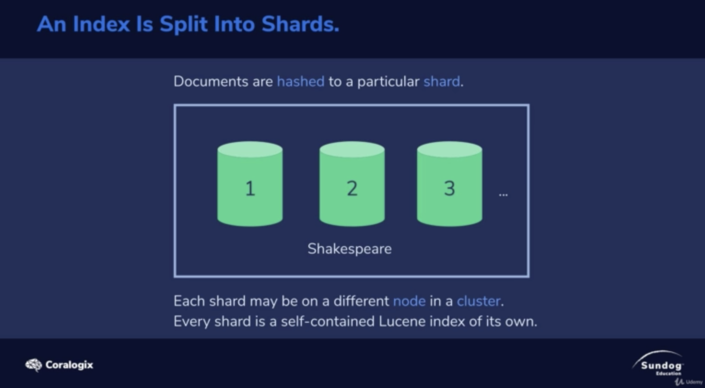
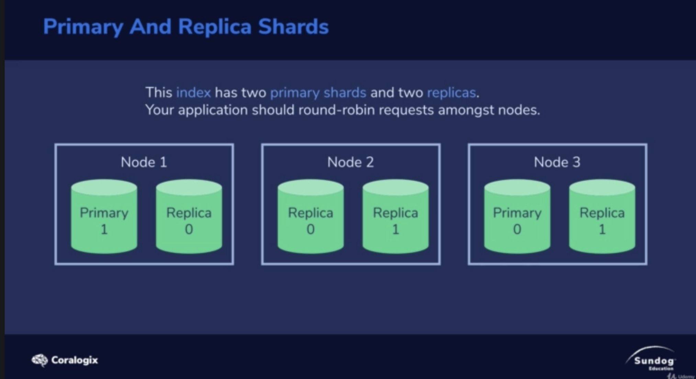
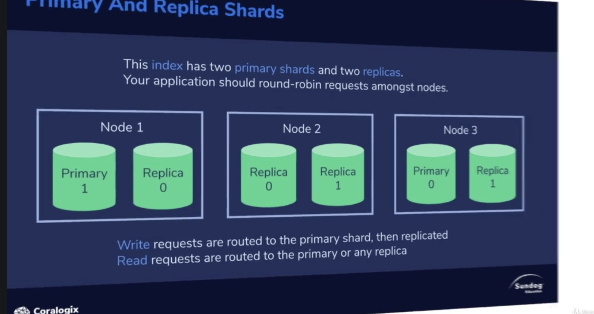
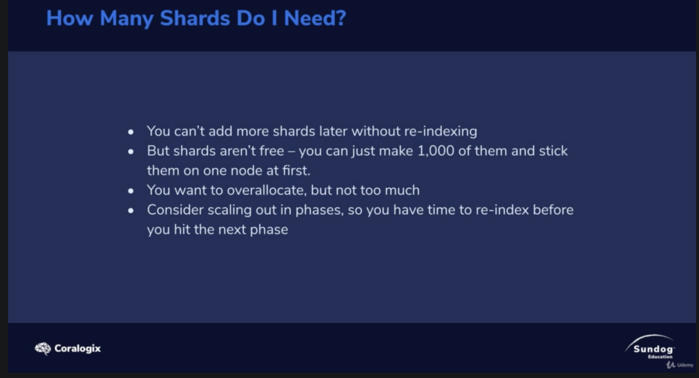
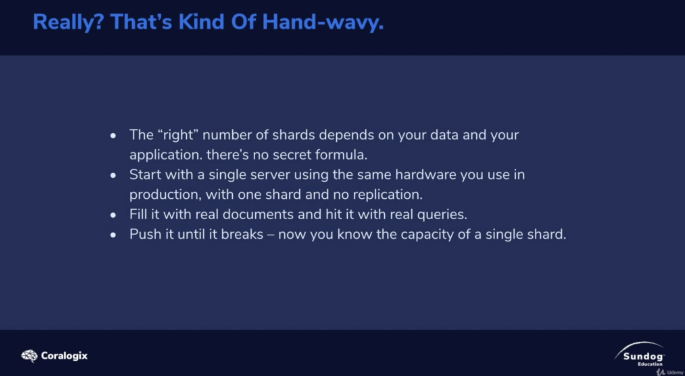
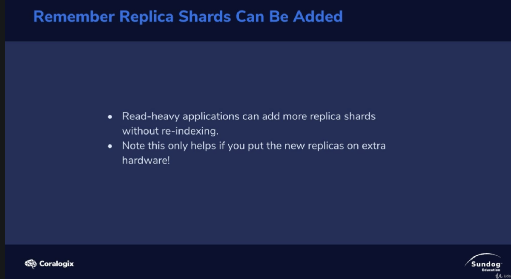

# An Index Is Split Into Shards

1. your index will be broken down into shards

2. index has two primary shards and two replicas
   1. replicas for fault tolerance
   2. replicas for read capacity(read can be map reduce via primary or replica)

3. the scarce resource(稀缺資源) here is primary shards (which handling writing data)

# Read a lot / write a little

You need more replicas, primary shards are not your issue.

- e.g. search on your own wiki

# Write a lot / read a little

ingesting(擷取) hug amounts of log all the time

primary shards more, less replicas

e.g. IoT sensors data warehouse

# How Many Shards Do I Need?

1. You can't add more shards later witnhout re-indexing.

No formula =(

Read request can be scalable =)
