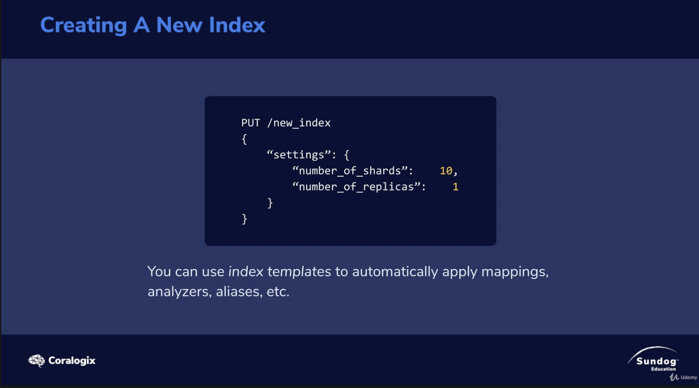

# Adding Indices as a Scaling Strategy

number of shards : 10  --> primary shard

replicas : 1 --> 1 replica for each primary shards

You might wanna use a index template to keep you use the same schema